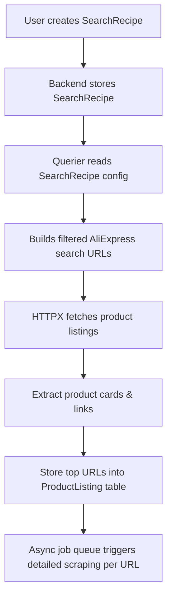

# Project Outline

(Update 04.02.2025)

# DSTool (Data Scraping Tool)

# Project Overview
DSTool is an automation tool designed to compare products from multiple eCommerce platforms, specifically MercadoLibre and AliExpress, in order to help users identify the best products for importing and selling based on factors like price, availability, shipping, and seller reputation. This tool leverages APIs from MercadoLibre and AliExpress, integrates image recognition, and presents the comparison data through a user-friendly admin interface built with Filament.

### Key Features:
- **Image Recognition**: Uses Google Vision (or similar) to identify products from images and match them between MercadoLibre and AliExpress.
- **API Integrations**:
    - MercadoLibre API: Fetches product data for MercadoLibre.
    - AliExpress API: Fetches product data for AliExpress.
- **Product Comparison and Ranking**: Compares features, pricing, availability, and shipping details to generate a weighted rank of products.
- **Admin Interface**: Uses Filament to display comparison data and manage products.
- **Automation**: Continuously loops through the comparison process, keeping the database updated with the latest product data and rankings.

## Motivation
### Problem Statement
As an eCommerce business, finding the best products to import and sell manually is inefficient and time-consuming. Automation can greatly speed up this process and improve decision-making.

### Solution
DSTool automates the comparison process across MercadoLibre and AliExpress, ranks products based on a weighted system, and provides a Filament-based admin interface to manage the data. This solution enables business scaling by automating repetitive tasks, allowing entrepreneurs to focus on higher-level strategy.

## Technical Architecture
The system integrates various services and technologies to achieve the product comparison and automation process:

| **Component**           | **Description**                                                                 |
|-------------------------|---------------------------------------------------------------------------------|
| **Google Vision**        | Identifies products in images and matches them between MercadoLibre and AliExpress. |
| **MercadoLibre API**     | Fetches product data (pricing, availability, etc.) from MercadoLibre.            |
| **AliExpress API**       | Fetches product data (pricing, availability, etc.) from AliExpress.             |
| **Backend**              | Python or Laravel for API integrations and data processing.                     |
| **Frontend**             | Filament Admin Panel for managing product data and reviewing results.           |
| **Database**             | Relational database (e.g., MySQL, PostgreSQL) for storing product information.   |

### Data Flow
1. **Google Vision (or similar)**: Identifies products from images and matches them across platforms.
2. **MercadoLibre API**: Retrieves product details from MercadoLibre.
3. **AliExpress API**: Retrieves product details from AliExpress.
4. **Product Comparison**: A weighted rank is generated based on price, availability, shipping terms, etc.
5. **Database**: Stores the comparison data for future access and analysis.
6. **Admin Interface**: Allows users to review and manage product selections.

# API Rate Limits and Considerations

| **Platform**           | **Rate Limit**                                  | **Notes**                                                                 |
|------------------------|-------------------------------------------------|---------------------------------------------------------------------------|
| **MercadoLibre API**    | 1,000 items per request, 100-1,500 requests/min | Be mindful of rate limits to avoid throttling or blocking.               |
| **AliExpress API**      | High rate limits, subject to freezes            | Rate limits are generous, but can temporarily freeze for excessive requests. |
| **Google Vision API**   | $1.50 per 1,000 images                          | May incur additional costs based on usage.                               |

### Handling Rate Limits
- **MercadoLibre**: Handle rate limiting by implementing retry mechanisms or exponential backoff. Consider caching results where possible to minimize API calls.
- **AliExpress**: Handle potential freezes by batching requests or spacing out calls.
- **Google Vision**: Consider batching image recognition requests or only running recognition on high-priority images to reduce costs.

## Challenges and Considerations
1. **API Rate Limits**: Both MercadoLibre and AliExpress have API rate limits. Careful management of these limits is necessary to avoid service interruptions.
2. **Cost of Image Recognition**: Regular image recognition could be costly, especially if processing a large volume of products.
3. **Data Consistency**: Differences in product information (e.g., availability, pricing) between platforms could lead to discrepancies. It’s important to account for these in the comparison algorithm.
4. **Scalability**: As the number of products grows, additional considerations for scaling, such as database optimizations and asynchronous processing, will be necessary.

## Use Cases
- **Automated Product Comparison**: Compare product listings from MercadoLibre and AliExpress to find the best import opportunities.
- **Best Product Selection**: Use the weighted ranking to identify which products are the best to import.
- **Data Management**: Review product data, rankings, and make informed decisions through the Filament Admin Interface.

## Future Improvements
- **Expand Platform Support**: Integrate additional platforms like eBay, Amazon, and Walmart for a wider product comparison pool.
- **Advanced Ranking Algorithms**: Implement machine learning or AI to improve product ranking based on additional factors (e.g., historical sales data, trends).
- **User Customization**: Allow users to define their own ranking criteria, adjusting the weight given to price, shipping time, reputation, etc.

# Project Setup and Installation

### Prerequisites
- Python or Laravel environment setup.
- API keys for MercadoLibre, AliExpress, and Google Vision.
- Database (e.g., MySQL, PostgreSQL).
- Filament Admin for managing data.

### Installation Instructions
1. Clone the repository:
   ```bash
   git clone https://github.com/yourusername/DSTool.git


# Feature 1
# MVP Development Plan - Product Matching Feature

## Overview  
This document outlines the development plan for the MVP of the Product Matching feature in the **Reimpact** project. The goal is to integrate an external Python API that handles the data processing while maintaining a structured architecture for scalability and optimization.

## Architecture Diagram  


## Development Roadmap  

| **Step** | **Task** | **Description** | **Dependencies** | **Priority** |
|----------|---------|----------------|------------------|--------------|
| **1** | Define API Integration | Identify endpoints for the Python API that handles product matching | API design | High |
| **2** | Set Up Laravel Backend | Create endpoints in Laravel to communicate with the Python API | Laravel setup | High |
| **3** | Develop Python API | Implement the logic for product matching using ML/NLP techniques if necessary | External API access | High |
| **4** | Establish Database Schema | Design tables for storing product matches and logs | Data modeling | Medium |
| **5** | Implement Filament UI | Use Filament to provide an admin interface for managing product matches | Backend API ready | Medium |
| **6** | Optimize Data Flow | Ensure efficient data retrieval and processing for scalability | Caching, Indexing | High |
| **7** | Implement Queue System | Use Laravel Queues to handle async API calls efficiently | Job dispatching setup | Medium |
| **8** | Testing & Debugging | Perform unit, integration, and performance tests | Complete features | High |
| **9** | Deployment & Monitoring | Deploy to production and set up logging & monitoring | Infrastructure setup | High |

## API Endpoints  

### Laravel API (Backend)
| **Method** | **Endpoint** | **Description** |
|------------|-------------|----------------|
| `POST` | `/api/products/match` | Sends product data to Python API for matching |
| `GET` | `/api/products/matches` | Retrieves matched products from DB |
| `GET` | `/api/products/matches/{id}` | Fetches details of a specific match |
| `DELETE` | `/api/products/matches/{id}` | Removes a match record |

### Python API
| **Method** | **Endpoint** | **Description** |
|------------|-------------|----------------|
| `POST` | `/match-products` | Accepts product data and returns possible matches |
| `GET` | `/match/{id}` | Retrieves a specific match result |

## Key Considerations  
- **Scalability**: Use queues & caching to improve performance  
- **Security**: API authentication via Laravel Sanctum  
- **Logging & Monitoring**: Use Laravel Telescope and Sentry  
- **Automation**: CI/CD pipelines for automatic deployment  

## Next Steps  
- Implement API stubs  
- Define data format & transformations  
- Build UI with Filament  

---

 *This plan will evolve as development progresses. Feedback & optimizations are always welcome!*

# API Plan
# DSTool Scraping & Comparison API – FastAPI + Laravel Integration


##  Project Scope

This module provides a backend system using **FastAPI** to handle the ingestion of scraped product data, comparison of products from different providers (e.g., AliExpress, MercadoLibre), and construction of a unified `ProductConcept`. The **Laravel** frontend consumes this API and stores the results in its database for user interaction and reporting.

---

##  Key Concepts

### Entities

| Entity              | Description                                                                 |
|---------------------|-----------------------------------------------------------------------------|
| `ScrapedProduct`     | Represents a product listing from a provider (e.g., AliExpress, ML).       |
| `ProductConcept`     | Represents a globally recognized product idea, grouping similar products.   |
| `ComparisonResult`   | Result of a product comparison including confidence score.                  |

### Workflow Summary

1. Laravel app scrapes or receives products from external platforms.
2. Sends data to FastAPI via `/products/scrape`.
3. After accumulating enough products, Laravel calls `/products/compare` to group similar ones.
4. FastAPI returns a `ProductConcept` built from those.
5. Laravel stores all this using mappers and Eloquent models.

---

##  Architectural Decisions

| Principle         | Implementation                                                                 |
|------------------|---------------------------------------------------------------------------------|
| **Modular Design** | Each responsibility in its own file: routes, services, models, DB.             |
| **Extensible**     | Starts with an in-memory database, pluggable with PostgreSQL or others later. |
| **Async-native**   | FastAPI uses async to handle IO-bound scraping tasks efficiently.             |
| **Laravel-First**  | Designed to be consumed cleanly by Laravel via HTTP + Mapper layer.            |

---

##  Architecture Diagram

```text
         Laravel Frontend
          ↕ HTTP Client
+-----------------------------+
|       FastAPI App          |
+-----------------------------+
| /products/                 |
| ├── POST /scrape           | ← accepts scraped product
| ├── POST /compare          | ← compares & builds concept
| └── GET  /all              | ← for listing/debugging
+-----------------------------+
|   Routers: products.py      |
|   Models: ScrapedProduct,   |
|           ProductConcept    |
|   Services: matcher.py,     |
|             aliexpress.py   |
|   DB: memory_store.py       |
+-----------------------------+
```

---

##  Laravel Integration Example

### Sending a Scraped Product to FastAPI

```php
$response = Http::post('http://localhost:8000/products/scrape', [
    'title' => $title,
    'description' => $desc,
    'price' => $price,
    'currency' => 'USD',
    'image_url' => $image,
    'provider' => 'AliExpress',
    'source_url' => $source,
    'fetched_at' => now()->toIso8601String(),
]);
```

### Mapping API Result to Eloquent Model

```php
class ScrapedProductMapper
{
    public static function fromApi(array $data): ScrapedProduct
    {
        return new ScrapedProduct([
            'external_id' => $data['id'],
            'title' => $data['title'],
            'price' => $data['price'],
            'image_url' => $data['image_url'],
            'provider' => $data['provider'],
            'source_url' => $data['source_url'],
            'fetched_at' => $data['fetched_at'],
        ]);
    }
}
```

### Comparison and Concept Building in Loop

```php
$scrapedIds = [];

foreach ($sources as $source) {
    $response = Http::post('http://localhost:8000/products/scrape', $source->toArray());
    $scraped = ScrapedProductMapper::fromApi($response->json());
    $scraped->save();

    $scrapedIds[] = $scraped->external_id;
}

$comparison = Http::post('http://localhost:8000/products/compare', $scrapedIds);
$concept = ProductConceptMapper::fromApi($comparison->json());
$concept->save();
```

---

##  Why FastAPI and Not Alternatives?

| Option     | Reason Rejected                                                              |
|------------|-------------------------------------------------------------------------------|
| Flask      | Not async-native, slower evolution, more boilerplate.                        |
| Django     | Too monolithic for microservice-style scraping.                              |
| Full ORM   | Overkill during early prototyping; in-memory store is faster for iteration.  |
| Direct scraping in route | Violates separation of concerns and testing boundaries.       |

---

##  KPIs & Expansion Roadmap

The system is built to support future metrics and operational dashboards:

- 📈 Sales volume tracking
- 📉 Price & sentiment trends
- 📊 Market share by provider
- 📦 Stock and shipping indicators
- ✅ Manual review flagging system

Future endpoints and enhancements may include:

- `/reviews/queue` – Manual product review queue
- `/scraped/history` – Versioned product listings
- `/images/match` – Visual comparison via Google Lens integration

---

##  Laravel Domain Mapping

| Laravel Model       | FastAPI Entity     | Mapper Class              |
|---------------------|--------------------|---------------------------|
| `ScrapedProduct`     | `ScrapedProduct`    | `ScrapedProductMapper`    |
| `ProductConcept`     | `ProductConcept`    | `ProductConceptMapper`    |
| (optional) `Comparison` | `ComparisonResult` | `ComparisonMapper`        |

---

##  Next Steps

- [ ] Add real scraping adapters for AliExpress & MercadoLibre.
- [ ] Integrate image/title matching algorithms.
- [ ] Containerize FastAPI for deployment in your infrastructure.
- [ ] Expand Laravel jobs/commands to automate ingestion.

---

#  DSTool API Architecture: Modular Design for Scalable Scraping & Quotation Automation


This document outlines the proposed API architecture and modular design for DSTool, a system that automates product scraping, intelligent matching, quotation generation, procurement automation, and marketplace integration.

---

##  Core Feature Modules & Responsibilities

| Module               | Description                                                                 |
|----------------------|-----------------------------------------------------------------------------|
| `scraping/`          | Extracts product data, applies image recognition (Google Lens), filters based on strategies |
| `selection/`         | Evaluates and selects optimal products within quality and budget constraints |
| `quotation/`         | Builds structured reports comparing options across quality, price, and availability |
| `procurement/`       | Places automatic orders on AliExpress and Alibaba for chosen products        |
| `listing/`           | Prepares and optimizes product listings for MercadoLibre                     |
| `evaluation/`        | Tracks product performance and informs re-listing or selection improvements  |

---

##  API Endpoint Design by Feature

### 🔍 `scraping/` – Intelligent Data Scraper

**Responsibilities**:
- Accept raw scraped data
- Enrich via Google Lens
- Filter by matching strategies

**Endpoints**:
```
POST /scraping/products       # Accept raw scraped data
POST /scraping/enrich         # Match with Google Lens
GET  /scraping/pending        # View unreviewed products
```

---

###  `selection/` – Automated Product Selection

**Responsibilities**:
- Score scraped products
- Rank within budget constraints
- Recommend top candidates

**Endpoints**:
```
POST /selection/evaluate          # Evaluate candidates
POST /selection/budgeted         # Evaluate within constraints
GET  /selection/recommended      # Top picks
```

---

###  `quotation/` – Quotation Engine

**Responsibilities**:
- Generate side-by-side comparisons
- Group by provider/product
- Export final quotes

**Endpoints**:
```
POST /quotation/build             # Build structured quote
GET  /quotation/:id               # View quote
GET  /quotation/download/:id      # Download PDF/CSV/JSON
```

---

###  `procurement/` – Procurement Automation

**Responsibilities**:
- Place real orders to marketplaces
- Return order tracking/status

**Endpoints**:
```
POST /procurement/order           # Submit order
GET  /procurement/status/:id      # Check fulfillment
```

---

###  `listing/` – Marketplace Integration (MercadoLibre)

**Responsibilities**:
- Prepare listings from concepts
- Optimize text/images
- Push to marketplace

**Endpoints**:
```
POST /listing/prepare             # Generate listing draft
POST /listing/publish             # Push to MercadoLibre
GET  /listing/status/:id          # Listing health
```

---

###  `evaluation/` – Performance & Re-Evaluation

**Responsibilities**:
- Track marketplace metrics
- Trigger re-selection or relisting

**Endpoints**:
```
GET  /evaluation/performance      # Dashboard
POST /evaluation/refresh          # Sync stats
POST /evaluation/relist           # Re-list based on rules
```

---

## Recommended Folder Structure

```
dstool/
├── scraping/             # Intelligent scraping
├── selection/            # Evaluation logic
├── quotation/            # Reporting engine
├── procurement/          # Ordering automation
├── listing/              # Marketplace integration
├── evaluation/           # Metrics and relisting logic
├── shared/               # Reusable helpers (enums, settings)
├── main.py               # FastAPI entry point
```

---

##  Architectural Justifications

| Decision                     | Justification                                                                 |
|-----------------------------|--------------------------------------------------------------------------------|
| **Modular by feature**      | Clear separation of concerns; scalable team collaboration                     |
| **Dedicated endpoints**     | Easy API consumption from Laravel or other clients                            |
| **Service layer abstraction**| Business logic is testable and isolated from HTTP routing                     |
| **Composable architecture** | You can easily orchestrate pipelines or async tasks per module                |

---

##  Consuming the API from Laravel

Use Laravel HTTP client inside a loop to consume endpoints:

```php
use Illuminate\Support\Facades\Http;

foreach ($scrapedData as $item) {
    $response = Http::post('https://dstool-api.local/scraping/products', [
        'title' => $item['title'],
        'image_url' => $item['image'],
        'price' => $item['price'],
        // ...
    ]);

    $scrapedProduct = ScrapedProductMapper::fromApiResponse($response->json());
    ScrapedProduct::updateOrCreate(['external_id' => $scrapedProduct->external_id], $scrapedProduct->toArray());
}
```

Use `Mappers` and a `Domain Layer` to handle transformation between API DTOs and Laravel Eloquent models cleanly.

---

##  Summary

This design ensures:
- **Clear separation of concerns**
- **Fast iteration and testability**
- **Laravel-friendly APIs**
- **Support for future providers and scaling**

---


(From before, February 2025)

# The problem

## 1. Problem Definition
| Question                | Answer                                                             |
|-------------------------|--------------------------------------------------------------------|
| **What problem are you solving?** | *Automatization to better use time for i) comparison, ii) selection, iii) quotation, iv) ordering, v) massive uploads filling, requerying / scrapping to consider historic changes and vi) sales meetrics to iterate*    |
| **Who is it for?**                | *dropshippers*                                      |
| **Why is it important?**          | *saves time*        |

---
## 2. Goal
| Question                              | Answer                                       |
|---------------------------------------|---------------------------------------------|
| **What is the goal of the project?**  | *making more money in the same time, tracking import operations* |

---
## 3. Core Features  
| Feature                                | Description                                                                 |
|----------------------------------------|-----------------------------------------------------------------------------|
| **Intelligent Data Scraper**           | *Extracts product data, applies image recognition (Google Lens), filters based on predefined strategies, and determines whether to store or discard items* |
| **Automated Product Selection**        | *Evaluates and selects the most cost-effective products while adhering to budget constraints* |
| **Comprehensive Quotation Engine**     | *Generates structured reports comparing final quotation alternatives based on price, quality, and availability* |
| **Seamless Procurement Automation**    | *Automates order placement on Alibaba and AliExpress for selected quotations* |
| **Scalable Marketplace Integration**   | *Prepares and optimizes bulk product listings for MercadoLibre, ensuring image and content compliance* |
| **Performance Optimization & Re-Evaluation** | *Monitors product performance on MercadoLibre, leveraging data-driven insights to refine future selections* |

---

## 4. Sketch or UI Ideas
| Question                    | Answer                                                                                     |
|-----------------------------|-------------------------------------------------------------------------------------------|
| **Do you have sketches or diagrams?** | *[Yes/No]*                                                                       |
| **Tool Used**               | *[Mention the tool used for creating sketches, e.g., Figma, Draw.io, etc.]*                |
| **Link to Designs**         | *[Provide a link to your sketches or UI mockups if applicable.]*                           |

---

## 5. Tech Stack
| Component          | Technology/Tool                  |
|---------------------|----------------------------------|
| **Frontend**        | *[e.g., React, Vue.js, etc.]*   |
| **Backend**         | *[e.g., Flask, Django, etc.]*   |
| **Database**        | *[e.g., SQLite, PostgreSQL]*    |
| **Hosting/Deployment** | *[e.g., Vercel, Heroku, AWS]*|

---

## 6. Architecture Plan
| Question                                   | Answer                                                  |
|-------------------------------------------|--------------------------------------------------------|
| **How will components interact?**         | *[Describe the interaction flow, e.g., frontend -> backend -> database.]* |
| **Diagram**                               | *[Include a link to an architecture diagram if applicable.]*               |

---

## 7. User Stories
| User Story                                                                                     | Priority (High/Medium/Low) |
|------------------------------------------------------------------------------------------------|----------------------------|
| *"As a [user], I want to [do something] so that [goal]."*                                      | *[Priority Level]*         |
| *"As a [user], I want to [do something else] so that [goal]."*                                 | *[Priority Level]*         |

---

## 8. Task Breakdown
| Task Name                    | Description                                         | Status (Pending/In Progress/Done) |
|------------------------------|-----------------------------------------------------|------------------------------------|
| **Set up project structure** | *[Describe what needs to be done here.]*            | *[Status]*                        |
| **Create database schema**   | *[Describe what needs to be done here.]*            | *[Status]*                        |
| **Develop feature X**        | *[Describe what needs to be done here.]*            | *[Status]*                        |

---

## 9. Start Coding
| Question                      | Answer                                                                                 |
|-------------------------------|---------------------------------------------------------------------------------------|
| **Where to begin?**           | *[Mention the priority areas to start coding, e.g., backend API, core feature, etc.]* |
| **What tools to use?**        | *[Mention tools like Git, IDEs, linters, testing frameworks, etc.]*                  |

---

## 10. Iteration and Feedback
| Question                                      | Answer                                                       |
|----------------------------------------------|-------------------------------------------------------------|
| **How will you get feedback?**               | *[Mention who will provide feedback, e.g., friends, mentors.]* |
| **What will you do with the feedback?**      | *[Describe how you’ll refine and improve the project.]*      |

---

## Example Scenarios (Optional)
| Scenario                   | Description                                              |
|----------------------------|----------------------------------------------------------|
| **Example Scenario Name**  | *[Explain a potential user interaction or use case.]*    |
| **Example Scenario Name**  | *[Explain a potential user interaction or use case.]*    |

---

## Additional Notes
| Question                      | Answer                                         |
|-------------------------------|-----------------------------------------------|
| **What challenges do you foresee?** | *[Describe any anticipated challenges.]* |
| **How will you address these challenges?** | *[Mention potential solutions.]*      |

# DSTool

To analyze different versions of the same Product Concept, I need not only a ScrapedProduct but also a ProductConcept.

A ProductConcept represents a globally recognized product idea, and multiple ScrapedProducts can be associated with it, each coming from a different source (e.g., AliExpress, Alibaba, MercadoLibre). Matching between scraped products and product concepts is automated using Google Lens, ensuring consistency and avoiding duplicate concepts.

Each ProductConcept is associated with historical statistics that are periodically updated based on new scraped data. Rather than accumulating all-time values, these stats are stored in fixed-time intervals (e.g., weekly) to allow trend analysis and better decision-making.

Tables & Relationships:


markdown
Copy
Edit
## Database Schema

### product_concepts
| Column                  | Type         | Description |
|-------------------------|-------------|-------------|
| uuid                    | UUID        | Unique identifier |
| name                    | STRING      | Concept name |
| category                | STRING      | Product category |
| description             | TEXT        | Description of the concept |
| created_at              | TIMESTAMP   | Record creation timestamp |
| updated_at              | TIMESTAMP   | Last update timestamp |
| stats_id                | UUID        | Foreign key to stats |
| concept_reviews_conclusion | TEXT    | AI-generated summary of reviews |
| manual_review_flag      | BOOLEAN     | If true, requires human review before confirming match |

---

### stats
| Column                  | Type         | Description |
|-------------------------|-------------|-------------|
| uuid                    | UUID        | Unique identifier |
| product_concept_id      | UUID        | Foreign key to product_concepts |
| average_sales          | FLOAT        | Average sales per period |
| stdev_sales           | FLOAT        | Standard deviation of sales |
| publications_number     | INT         | Number of active listings |
| ali_to_meli_rate       | FLOAT        | Ratio of AliExpress to MercadoLibre sales |
| growth_rate            | FLOAT        | Sales growth percentage over time |
| price_trend           | FLOAT        | Change in average price over time |

---

### product_concept_stats_history
| Column                  | Type         | Description |
|-------------------------|-------------|-------------|
| uuid                    | UUID        | Unique identifier |
| product_concept_id      | UUID        | Foreign key to product_concepts |
| timestamp               | TIMESTAMP   | When stats were recorded |
| average_sales          | FLOAT        | Average sales at this point in time |
| stdev_sales           | FLOAT        | Standard deviation of sales |
| publications_number     | INT         | Number of active listings at this point in time |
| ali_to_meli_rate       | FLOAT        | Historical AliExpress to MercadoLibre rate |
| growth_rate            | FLOAT        | Historical growth percentage |
| price_trend           | FLOAT        | Price trend at this point in time |

---

### scraped_products
| Column                  | Type         | Description |
|-------------------------|-------------|-------------|
| uuid                    | UUID        | Unique identifier |
| name                    | STRING      | Product name |
| category                | STRING      | Product category |
| sales_quantity         | INT         | Units sold |
| price                  | FLOAT       | Price in USD |
| currency               | STRING      | Always 'USD' |
| source_id              | UUID        | Foreign key to sources |
| created_at              | TIMESTAMP   | Record creation timestamp |
| updated_at              | TIMESTAMP   | Last update timestamp |
| product_concept_id      | UUID        | Foreign key to product_concepts |
| provider_id            | UUID        | Foreign key to providers |
| review_conclusion      | TEXT        | AI-generated summary of reviews |
| stars                 | FLOAT       | Average star rating |
| photo_path            | JSON        | List of product images |
| reviews_count         | INT         | Number of reviews |
| stock_quantity        | INT         | Units available in stock |
| shipping_date         | DATE        | Estimated shipping date |
| shipping_cost         | FLOAT       | Cost of shipping in USD |
| shipping_currency     | STRING      | Always 'USD' |
| matching_confidence_score | FLOAT  | Score from Google Lens for matching accuracy (0-100%) |

---

### sources
| Column                  | Type         | Description |
|-------------------------|-------------|-------------|
| uuid                    | UUID        | Unique identifier |
| source_origin          | STRING      | Marketplace (AliExpress, Alibaba, etc.) |
| url                    | STRING      | Website URL |

---

### providers
| Column                  | Type         | Description |
|-------------------------|-------------|-------------|
| uuid                    | UUID        | Unique identifier |
| name                    | STRING      | Provider name |
| source_id               | UUID        | Foreign key to sources |
| created_at              | TIMESTAMP   | Record creation timestamp |
| updated_at              | TIMESTAMP   | Last update timestamp |

---

### reviews
| Column                  | Type         | Description |
|-------------------------|-------------|-------------|
| uuid                    | UUID        | Unique identifier |
| reviewer_name          | STRING      | Name of the reviewer |
| scraped_product_id      | UUID        | Foreign key to scraped_products |
| content                | TEXT        | Review content |
| photo_path             | JSON        | Array of review images |
| stars                  | FLOAT       | Review star rating |
| helpful_votes         | INT         | Number of people who found the review helpful |


### Summary of KPIs

| **KPI Group**               | **KPI**                                             | **Table**                   | **Columns**                                  |
|-----------------------------|-----------------------------------------------------|-----------------------------|----------------------------------------------|
| **Demand Indicators**        | 1. Sales Volume, 2. Sales Growth, 3. Sales Frequency| `sales`, `sales_per_period`  | `quantity_sold`, `total_sales`, `period`     |
| **Pricing and Profitability**| 4. Price Variability, 5. Profit Margin, 6. Price Difference, 7. Avg Profit per Sale | `product_prices`, `competitor_prices`, `sales` | `price`, `competitor_price`, `sale_price`    |
| **Competition Analysis**     | 8. Competitor Price Comparison, 9. Market Share, 10. Competitor Rating | `competitor_prices`, `competitors`, `sales` | `competitor_price`, `quantity_sold`, `rating`|
| **Quality and Appeal**      | 11. Product Rating, 12. Review Sentiment           | `reviews`                   | `rating`, `review_text`                      |
| **Trend and Time**          | 13. Price Trend, 14. Sales Trend                   | `product_prices`, `sales`   | `price`, `quantity_sold`, `timestamp`        |
| **Consumer Behavior**       | 15. Purchase Frequency, 16. Avg Quantity per Consumer | `sales`, `sales_per_period` | `quantity_sold`, `total_sales`               |
| **Market Opportunity**      | 17. Stock Availability, 18. Restock Trends         | `stock`                     | `stock_quantity`, `restock_date`             |
| **Historical Data**         | Historical Performance                             | `sales`, `product_prices`, `competitor_prices` | `timestamp`, `quantity_sold`, `price`        |
| **Operational Factors**     | Stock and Shipping                                 | `stock`, `shipping`         | `stock_quantity`, `shipping_cost`            |
| **Advanced Metrics**        | Complex Data Analysis                              | `sales`, `product_prices`, `competitor_prices` | `quantity_sold`, `price`, `competitor_price` |
| **Data Aggregation**        | Consolidated Views                                 | `sales_per_period`          | `total_sales`, `total_quantity_sold`         |

### blueprint yaml

models:
  ProductConcept:
    uuid: uuid primary
    name: string
    category: string
    description: text
    created_at: timestamp
    updated_at: timestamp
    stats_id: uuid foreign:Stats
    concept_reviews_conclusion: text
    manual_review_flag: boolean default:false
    relationships:
      hasMany: ScrapedProduct, ProductConceptStatsHistory

  Stats:
    uuid: uuid primary
    product_concept_id: uuid foreign:ProductConcept
    average_sales: float
    stdev_sales: float
    publications_number: integer
    ali_to_meli_rate: float
    growth_rate: float
    price_trend: float
    relationships:
      belongsTo: ProductConcept

  ProductConceptStatsHistory:
    uuid: uuid primary
    product_concept_id: uuid foreign:ProductConcept
    timestamp: timestamp
    average_sales: float
    stdev_sales: float
    publications_number: integer
    ali_to_meli_rate: float
    growth_rate: float
    price_trend: float
    relationships:
      belongsTo: ProductConcept

  ScrapedProduct:
    uuid: uuid primary
    name: string
    category: string
    sales_quantity: integer
    price: float
    currency: string default:'USD'
    source_id: uuid foreign:Source
    created_at: timestamp
    updated_at: timestamp
    product_concept_id: uuid foreign:ProductConcept
    provider_id: uuid foreign:Provider
    review_conclusion: text nullable
    stars: float nullable
    photo_path: json nullable
    reviews_count: integer
    stock_quantity: integer
    shipping_date: date nullable
    shipping_cost: float nullable
    shipping_currency: string default:'USD'
    matching_confidence_score: float nullable
    relationships:
      belongsTo: ProductConcept, Source, Provider
      hasMany: Review

  Source:
    uuid: uuid primary
    source_origin: string
    url: string

  Provider:
    uuid: uuid primary
    name: string
    source_id: uuid foreign:Source
    created_at: timestamp
    updated_at: timestamp
    relationships:
      belongsTo: Source

  Review:
    uuid: uuid primary
    reviewer_name: string
    scraped_product_id: uuid foreign:ScrapedProduct
    content: text
    photo_path: json nullable
    stars: float
    helpful_votes: integer nullable
    relationships:
      belongsTo: ScrapedProduct

### TODO 

| **Question** | **Decision Needed** | **Current Status** | **Possible Actions** |
|-------------|--------------------|--------------------|---------------------|
| **How to handle duplicate ProductConcepts?** | Should we allow merging? | Not yet implemented | Add `merged_into_id` and `status` field in `ProductConcept`. |
| **How to track price & sales changes over time?** | Do we need historical price/sales tracking? | Not yet implemented | Create `ScrapedProductHistory` table. |
| **How to manage manual review of ProductConcepts?** | Should there be a queue system for review? | `manual_review_flag` exists but no tracking | Add `ProductConceptReviewQueue` table. |
| **How to track products appearing on multiple sources?** | Can a ScrapedProduct exist in multiple sources? | `source_id` is a single foreign key | Convert to many-to-many with `ScrapedProductSource`. |
| **Should we track overall sentiment from reviews?** | Do we need an AI-generated sentiment score? | Not yet implemented | Add `average_sentiment_score` to `ScrapedProduct`. |
| **Who scraped the product?** | Do we need to store the scraper identity? | Not yet implemented | Add `scraped_by` field to `ScrapedProduct`. |
| **How should we store images?** | Should images be separate records instead of JSON? | `photo_path` is a JSON field | Create `ScrapedProductImage` table. |

### Are we covering?
Here are the core features you originally outlined and a check to see if they are covered in the schema:

markdown
Copy
Edit
| **Feature** | **Description** | **Covered?** | **Notes** |
|------------|---------------|-------------|-----------|
| **Scraping & Comparing** | Scrapes data from Aliexpress, Alibaba, and Mercadolibre. Uses Google Lens and filtering strategies to compare. | ✅ | We have `scraped_products`, `sources`, `providers`, and `product_concepts`. Matching score added. |
| **Storage & Discarding** | Stores or discards scraped products based on criteria. | ✅ | `review_conclusion` field allows filtering. A flag for "discarded" might be useful. |
| **Best Selection for Budget** | Picks the best products for import based on budget constraints. | ⚠️ | No explicit budget-related table/columns. Should we add `cost_analysis` fields? |
| **Quotation & Reporting** | Generates reports for product selections. | ⚠️ | No explicit reporting system in DB yet. Could be managed in app logic. |
| **Automated Ordering** | Orders selected products from Aliexpress/Alibaba. | ❌ | No direct handling of ordering process. Could be an external integration. |
| **Massive Upload to Mercadolibre** | Creates MercadoLibre listings with images, descriptions, and prices. | ✅ | `ScrapedProduct` structure supports it. Consider a `MercadoLibreListing` table for structured uploads. |
| **Tracking Performance of Selected Products** | Monitors performance to refine future selections. | ✅ | `stats` table tracks sales and trends. Historical stats are planned. |
Possible Additions
Budget constraints: Should we add a budget table or max_budget field to ProductConcept?
Reporting system: Should reports be stored in a separate reports table?
Order tracking: Do you want to track orders in the DB or rely on external integrations?
Mercadolibre automation: If we manage massive uploads, should we track listing statuses (published, pending, failed)?


# API Features

## 🔎 SearchRecipe System — URL Collector & Async Scraping Pipeline

This module allows users to create reusable **search recipes** that are used to generate filtered AliExpress product searches, gather a list of relevant product URLs, and spawn asynchronous jobs to scrape product data.

---

### System Overview



---

### Models

#### `SearchRecipe`

| Field        | Type         | Description                                 |
|--------------|--------------|---------------------------------------------|
| `id`         | UUID         | Unique ID                                   |
| `name`       | string       | Recipe title                                |
| `keywords`   | List[string] | Keywords to search                          |
| `min_price`  | float?       | Optional price filter (min)                 |
| `max_price`  | float?       | Optional price filter (max)                 |
| `sort_by`    | string?      | e.g. `orders_desc`, `price_asc`             |
| `category`   | string?      | Optional category or tag                    |
| `created_at` | datetime     | Timestamp                                   |

#### `ProductListing`

| Field             | Type     | Description                                  |
|-------------------|----------|----------------------------------------------|
| `id`              | UUID     | Unique ID                                    |
| `search_recipe_id`| UUID     | FK to SearchRecipe                           |
| `product_url`     | string   | URL of the product                           |
| `title`           | string   | Title (if available from search card)        |
| `price`           | float?   | Price preview                                |
| `image_url`       | string?  | Thumbnail image                              |
| `imported`        | boolean  | Whether full data was scraped                |

---

### API Endpoints

```http
# Create a new search recipe
POST /search-recipes/

# List all saved search recipes
GET /search-recipes/

# Execute recipe: gather URLs and queue scraping jobs
POST /search-recipes/{id}/run

# Get all product URLs collected by a recipe
GET /search-recipes/{id}/urls
```

---

###  Workflow Summary

1. **User** defines a new `SearchRecipe` with keywords and filters.
2. **Querier** builds AliExpress search URLs using the recipe.
3. **HTTPX engine** scrapes HTML pages, extracting top product cards.
4. **Relevant product URLs** are saved to the `ProductListing` table.
5. An **async background job** is triggered for each URL, fetching full product data and storing it.

---

### Benefits

- **Separation of concerns**: Recipes define *what* to search; querier handles *how*.
- **Scalability**: Easily plug in other marketplaces (e.g., MercadoLibre).
- **Extensible**: Future AI-powered keyword generation or batch category expansion.
- **Asynchronous**: Queueing system makes it fast and non-blocking.

---

### ✅ Example Usage

```json
POST /search-recipes
{
  "name": "USB Hubs under $15",
  "keywords": ["usb hub", "usb splitter"],
  "min_price": 5,
  "max_price": 15,
  "sort_by": "orders_desc"
}
```

This creates a recipe that the user can execute later with:

```http
POST /search-recipes/{id}/run
```

This will gather URLs, enqueue scraping jobs, and feed a list of products into the system.

---

> Designed using **KISS** and **SOLID** principles: simple models, clear responsibility layers, and extensible async processing.


<p align="center"><a href="https://laravel.com" target="_blank"></a></p>

<p align="center">
<a href="https://github.com/laravel/framework/actions"></a>
<a href="https://packagist.org/packages/laravel/framework"></a>
<a href="https://packagist.org/packages/laravel/framework"></a>
<a href="https://packagist.org/packages/laravel/framework"></a>
</p>

## About Laravel

Laravel is a web application framework with expressive, elegant syntax. We believe development must be an enjoyable and creative experience to be truly fulfilling. Laravel takes the pain out of development by easing common tasks used in many web projects, such as:

- [Simple, fast routing engine](https://laravel.com/docs/routing).
- [Powerful dependency injection container](https://laravel.com/docs/container).
- Multiple back-ends for [session](https://laravel.com/docs/session) and [cache](https://laravel.com/docs/cache) storage.
- Expressive, intuitive [database ORM](https://laravel.com/docs/eloquent).
- Database agnostic [schema migrations](https://laravel.com/docs/migrations).
- [Robust background job processing](https://laravel.com/docs/queues).
- [Real-time event broadcasting](https://laravel.com/docs/broadcasting).

Laravel is accessible, powerful, and provides tools required for large, robust applications.

## Learning Laravel

Laravel has the most extensive and thorough [documentation](https://laravel.com/docs) and video tutorial library of all modern web application frameworks, making it a breeze to get started with the framework.

You may also try the [Laravel Bootcamp](https://bootcamp.laravel.com), where you will be guided through building a modern Laravel application from scratch.

If you don't feel like reading, [Laracasts](https://laracasts.com) can help. Laracasts contains thousands of video tutorials on a range of topics including Laravel, modern PHP, unit testing, and JavaScript. Boost your skills by digging into our comprehensive video library.

## Laravel Sponsors

We would like to extend our thanks to the following sponsors for funding Laravel development. If you are interested in becoming a sponsor, please visit the [Laravel Partners program](https://partners.laravel.com).

### Premium Partners

- **[Vehikl](https://vehikl.com/)**
- **[Tighten Co.](https://tighten.co)**
- **[WebReinvent](https://webreinvent.com/)**
- **[Kirschbaum Development Group](https://kirschbaumdevelopment.com)**
- **[64 Robots](https://64robots.com)**
- **[Curotec](https://www.curotec.com/services/technologies/laravel/)**
- **[Cyber-Duck](https://cyber-duck.co.uk)**
- **[DevSquad](https://devsquad.com/hire-laravel-developers)**
- **[Jump24](https://jump24.co.uk)**
- **[Redberry](https://redberry.international/laravel/)**
- **[Active Logic](https://activelogic.com)**
- **[byte5](https://byte5.de)**
- **[OP.GG](https://op.gg)**

## Contributing

Thank you for considering contributing to the Laravel framework! The contribution guide can be found in the [Laravel documentation](https://laravel.com/docs/contributions).

## Code of Conduct

In order to ensure that the Laravel community is welcoming to all, please review and abide by the [Code of Conduct](https://laravel.com/docs/contributions#code-of-conduct).

## Security Vulnerabilities

If you discover a security vulnerability within Laravel, please send an e-mail to Taylor Otwell via [taylor@laravel.com](mailto:taylor@laravel.com). All security vulnerabilities will be promptly addressed.

## License

The Laravel framework is open-sourced software licensed under the [MIT license](https://opensource.org/licenses/MIT).
